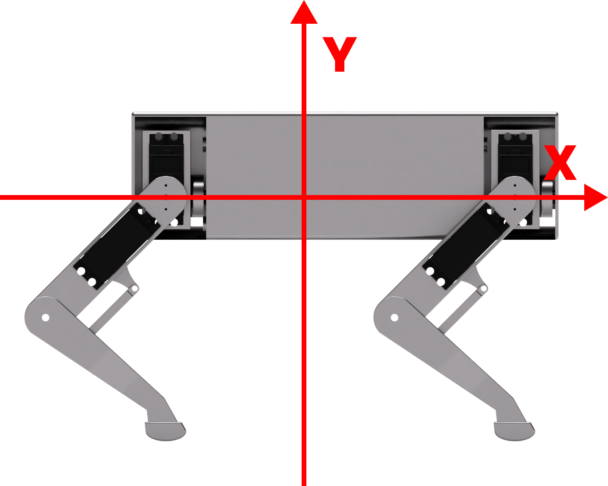
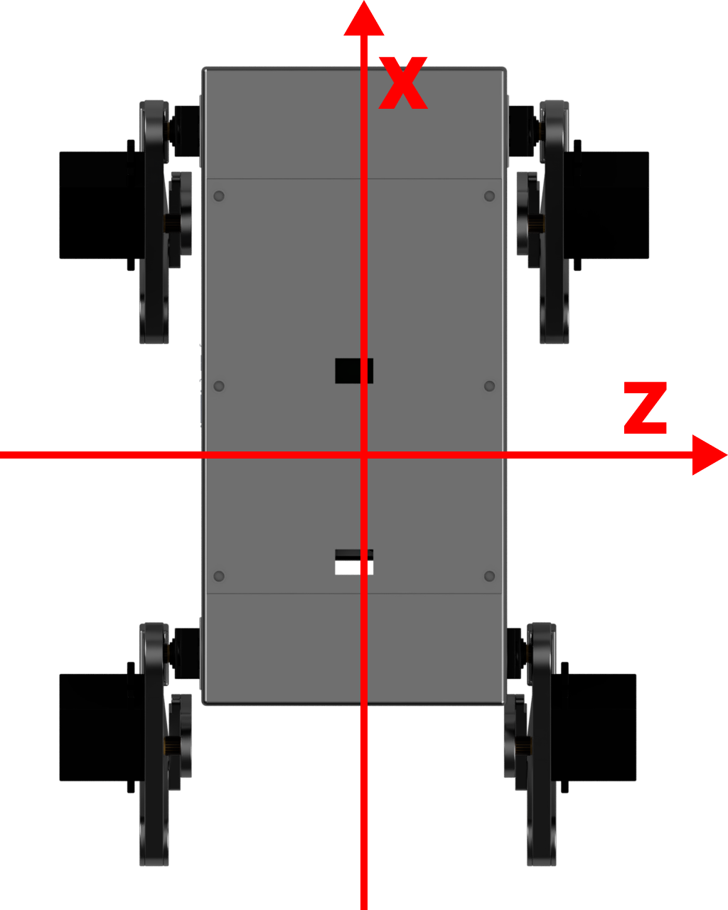

# Defining AQLARP's coordinate system
Knowing AQLARP's coordinate system is import so you know what setting each axis will do.
Here are the definitions for it:
- X-axis:
	- Increasing the value will make AQLARP move to the front
	- Decreasing the value will make AQLARP move to the back
- Y-axis:
	- Increasing the value will make AQLARP go up
	- Decreasing the value will make AQLARP go down
- Z-axis:
	- Increasing the value will make AQLARP go to the right
	- Decreasing the value will make AQLARP go to the left

The origin of these axis is where the leg is connected to the top joint, this is a per leg coordinate system.

Below are some images to clarify what axis does what.
