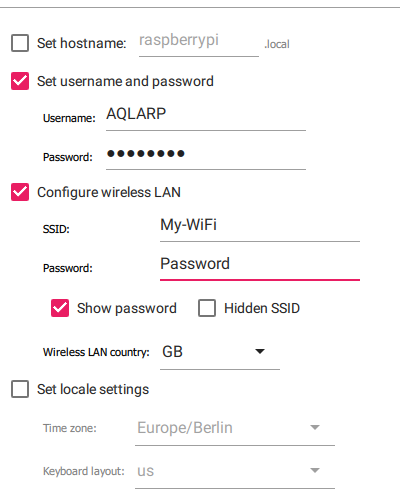
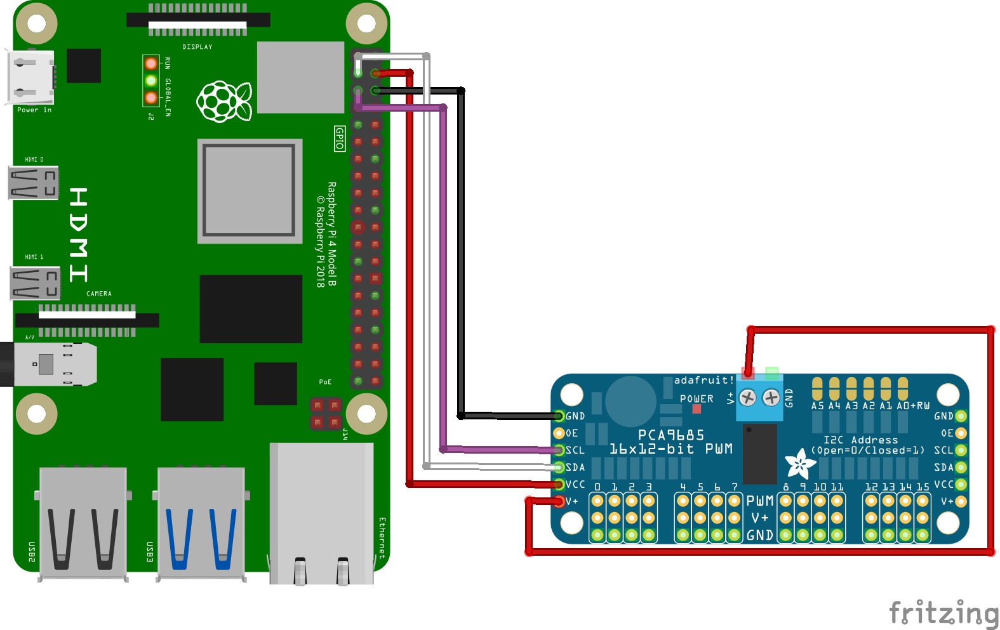

# Raspberry Pi setup
During the build process, it will be required to set the servos to 90 degrees at some points. To do this the raspberry pi should be set up and connected to the servo controller, which is what we will be doing here.

## Installing Ubuntu
Firstly, install the [Raspberry Pi Imager](https://www.raspberrypi.com/software/) from their website. This is what we will be using to flash the Ubuntu image to a micro SD card.

After installing the imager open it up and select the appropriate Raspberry Pi device, if you are using the same parts this will be a Raspberry Pi 4. Then Click `Choose OS` and scroll down to `Other general-purpose OS` and click it. Then select Ubuntu and choose any 64-bit version. I would recommend using the latest LTS version (22.04.4 LTS at the time of writing). If you plan on ever connecting a display, choose the desktop version, otherwise the server version will be fine. Make sure to select a 64-bit version.

Now you have to specify some settings, to do this press `Ctrl + Shift + X`. Check the Checkbox `Set username and password`. For username you can set what you want, but the rest of this documentation will be based in the username `AQLARP`. Then choose a password you can easily remember, as we will need this later. Next, check the checkbox `Configure wireless LAN`, set `SSID` to the name of your WiFi network and enter the password in the password field.


Then click save, select your micro SD card with the storage button and click next to start flashing the image to the SD card. After this is done put the micro SD card in the raspberry pi and power it using the USB C port.

## Connecting to the raspberry pi
Next you will have to find the IP of your Raspberry Pi. If you have access to the router you can log in to it's dashboard and find the IP as such. If you don't have access to the router finding the IP will be significantly harder and you will have to use a tool like nmap to find the IP. Make sure you can access other devices (like the Raspberry Pi) on your network. Some school or work networks might block this. If you cannot access other devices on your network, I would recommend using a [cheap travel router](https://www.amazon.nl/GL-iNet-GL-MT300N-V2-Reiserouter-Repeater-Extender/dp/B073TSK26W). As an added bonus of this you will be able to easily view the Raspberry Pi's IP in the router's dashboard.

Once you have the IP you can connect using ssh. To do this open a terminal (search `cmd` in Windows and open it) then execute the following command:
```console
$ ssh AQLARP@<Raspberry Pi Ip>
```
If you chose a different username than AQLARP, put it in the command instead of AQLARP. It will then ask you to input the password you chose when setting it up. If you can't immediately connect to the Raspberry Pi, be patient since it can take a few minutes for the Raspberry Pi to boot up.

## Clone the Github Repo
Next you will have to clone the GitHub repo, since this contains all of AQLARP's code. To do this run:
```console
$ git clone https://github.com/DeDiamondPro/AQLARP.git
```

## Install dependencies
To use the scripts, some basic dependencies have to be installed. To do this run the following commands
```console
$ sudo apt update
$ supt apt install -y python3 python3-pip i2c-tools
$ python3 -m pip install adafruit-circuitpython-servokit rpi.gpio
```

## Connecting the servo driver
To connect to the servo driver, you can check the wiring image below.
The loopback from V+ to V+ might not be required if it is attached correctly, but it was required for me.

Connect V+ and GND (the socket version) to a power supply of 5-7V. This can be the battery and a voltage regulator if you wish.

Now to check if the controller is connected correctly, run the following command.
```
$ i2cdetect -y 1
```
You should see it show up with the address `0x40`