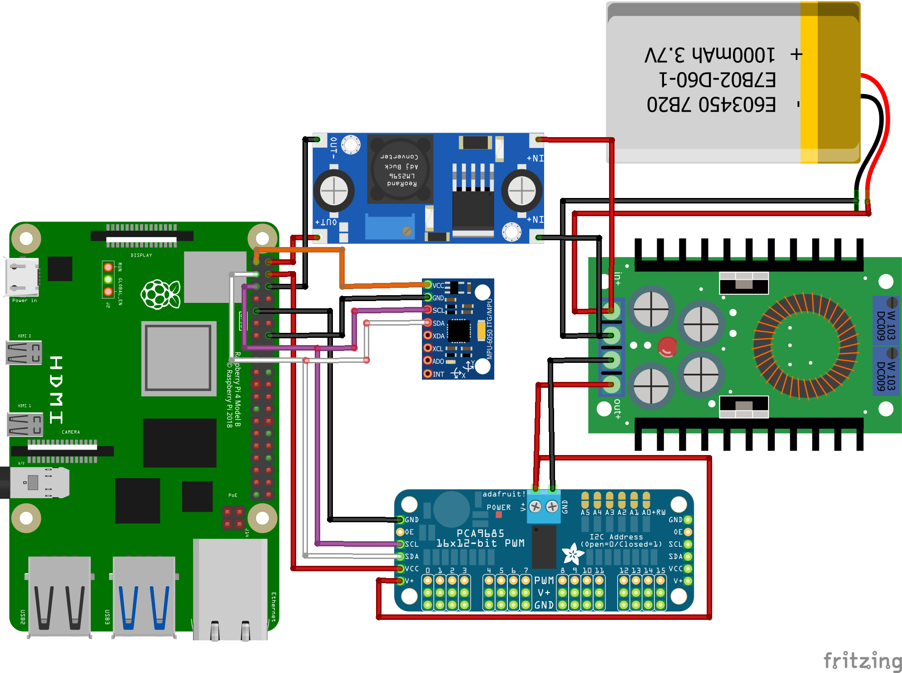
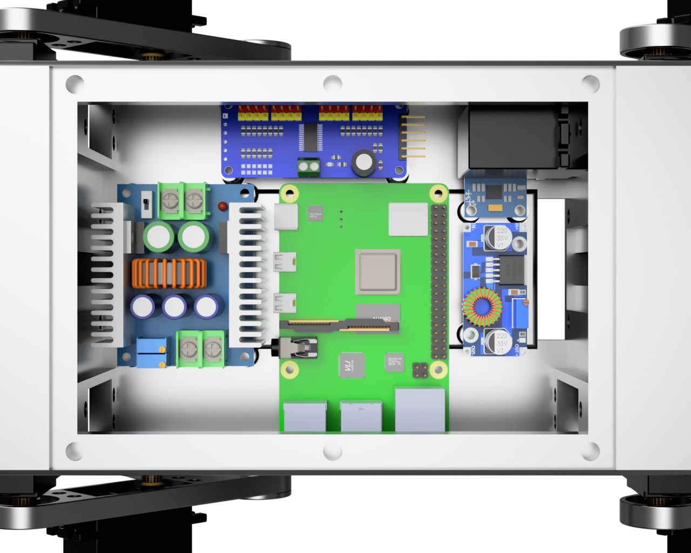

# Building The Main Body
In this chapter we will go over building the main body.
## Required 3D-printed parts
- [Main-Body](https://github.com/DeDiamondPro/AQLARP/blob/master/models/stl/body/Main-Body.stl)
- [Front-Back-Body](https://github.com/DeDiamondPro/AQLARP/blob/master/models/stl/body/Front-Back-Body.stl) x2
- [Top-Joint-Left](https://github.com/DeDiamondPro/AQLARP/blob/master/models/stl/body/Top-Joint-Left.stl) x2
- [Top-Joint-Right](https://github.com/DeDiamondPro/AQLARP/blob/master/models/stl/body/Top-Joint-Right.stl) x2
- [Top-Cover](https://github.com/DeDiamondPro/AQLARP/blob/master/models/stl/body/Top-Cover.stl)
- [Nut-Tool](https://github.com/DeDiamondPro/AQLARP/blob/master/models/stl/misc/Nut-Tool.stl) (Needed for assembly, breaks quite easily, you might need multiple)

## Assembly
First install the 3D-printing inserts into the main body. There are holes for 6 M4 inserts at the top and 14 standoffs with place for M3 inserts in the bottom. To insert an insert carefully place it on the hole and then push it in using a sottering iron, this melts the plastic around it so the insert can slide right in and stay there securely.

Then install the 4 servos in the corners of the main body, these should be installed with the servo gear at the bottom. The locknuts should be on the inside and the screws at the outside. Unfortunately it is practically impossible to reach the nuts at the bottom when tightening the screws. To address this you can use the nut tool file I provided, load 2 nuts in it and place it where you need it then screw the screws in to the nuts and tighten the servo that way. Be careful not to overtighten it since the nut tool snaps very easily.

After that is done you need to install the circular servo attachments to the top joint parts using the 4 small screws. Now connect the servos in the corners to the servo driver and set them to 90° using this command.
```console
$ python3 ~/AQLARP/scripts/set90.py
```
Now install the top joint part, make it so it is as straight as possible. Then use an M3 screw to screw it into the servo from the side.

After that is done you can install the final servo into the top joint part using M4 screws and locknuts. Then set them all to 90 degrees using the command above again and then install the leg on it, again trying to make it as straight as possible.

Now we will install the front and back cover, to do this first feed the wires of the servos trough the hole at the bottom and into the main body, and then attach the front/back cover using 4 M4 screws and locknuts.

## Wiring
We will create the wiring outside of the body before moving it in, this is easier since we have more space to work with outside of the body.

Connect the battery to the voltage regulators so you can configure their target voltage. Adjust the 20A voltage regulator until it outputs about 6.8V and adjust the XL4005 voltage regulator until it outputs 5V. This is very important as a wrong voltage could destroy your components.

Now wire everything up as shown in the image below.

Please note the voltage regulators in the image aren't the same as those actually used. Make sure you connect the negative and positive pole correctly.

To connect the gryo and servo controller to the same pin you need Y-wires, you can easily create 2 of these by cutting open 2 jumper wires and soldering 3 parts together.

## Connecting the servos
It is vital you connect each leg to the correct pin on the servo controller. The top joint should be the first of the 3 pins, the bottom joint the second and the sideways joint the third.
The pins for the legs are as follows:
- Front Left: pin 9-11
- Front Right: pin 0-2
- Back Left: pin 6-8
- Back Right: pin 3-5

## Installing in body
Now you just have to install all components in the body as is shown in the image below.


After that is done you just have to install the top cover and then you're done!